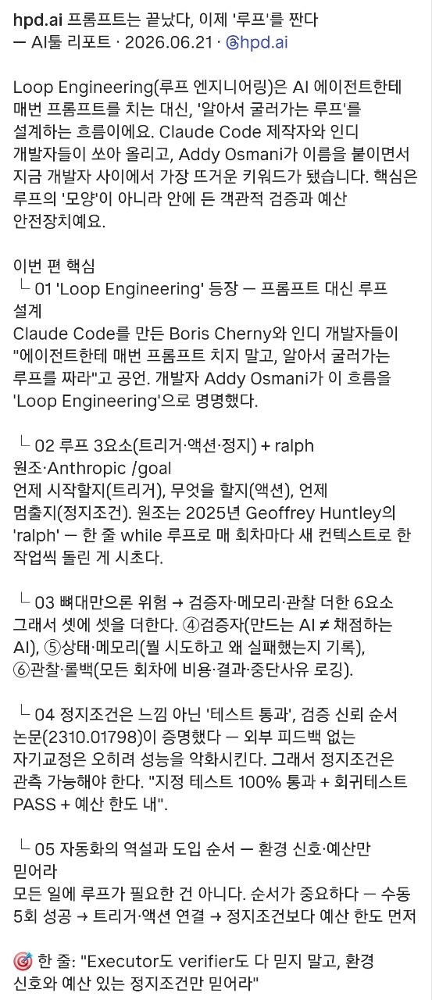

# hpd.ai — “프롬프트는 끝났다, 이제 루프를 짠다”

> Source: 사용자 공유 스크린샷. 원문 전문이 아니라 공개 저장에 적합한 메타데이터와 짧은 요약만 보존한다.

## Capture metadata

- 원문 표기: `hpd.ai 프롬프트는 끝났다, 이제 '루프'를 짠다`
- 표기된 날짜: 2026-06-21
- 표기된 작성자/출처: `@hpd.ai`
- 캡처 종류: 한국어 이미지 카드 / AI툴 리포트

## 요약

이 캡처는 AI 에이전트 사용의 중심이 단발성 프롬프트 작성에서 **반복 실행 구조를 설계하는 일**, 즉 [[Loop Engineering]]으로 이동하고 있다고 주장한다.

핵심 주장은 다음과 같다.

- 좋은 에이전트 운영은 “한 번 잘 시키기”보다 **트리거 → 액션 → 정지조건**으로 반복 가능한 루프를 만드는 데 가깝다.
- 단순히 루프만 만들면 위험하다. 루프 안에는 **검증자**, **메모리**, **관찰/로그**, **예산 안전장치**가 필요하다.
- 정지조건은 “이쯤이면 됐다” 같은 감각이 아니라 테스트 통과, 회귀 테스트 PASS, 예산 한도 같은 관측 가능한 조건이어야 한다.
- 모든 작업을 자동화 루프로 바꾸는 것이 답은 아니다. 먼저 수동으로 여러 번 성공시킨 뒤, 반복 패턴이 안정되면 트리거와 액션을 연결하고, 정지조건보다 예산 한도를 먼저 둔다.

## 짧은 인용

> “Executor도 verifier도 다 믿지 말고, 환경 신호와 예산 있는 정지조건만 믿어라.”

## 연결되는 개념

- [[Loop Engineering]] — 이 캡처의 중심 개념.
- [[LLM Wiki]] — 에이전트가 지식을 반복적으로 정리·검증하는 운영 구조와 연결된다.
- [[Knowledge Compounding]] — 반복 루프가 검증된 산출물을 누적 지식으로 바꿀 때 지식 복리 효과가 생긴다.
